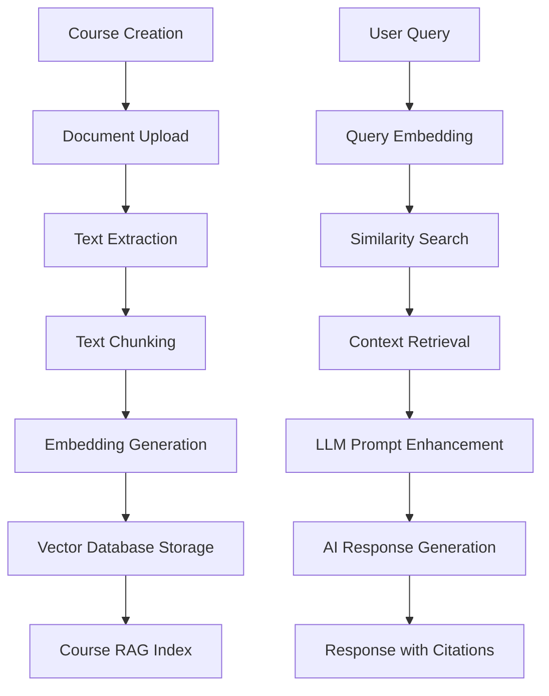

# Wingman RAG System - Technical Documentation

## Overview

Wingman is an intelligent learning assistant that uses a sophisticated Retrieval-Augmented Generation (RAG) system to provide contextual answers from course materials. This document provides a comprehensive technical breakdown of how the RAG system works, from document ingestion to chat responses.

## Architecture Overview



## System Components

### 1. Database Schema

The RAG system uses PostgreSQL with pgvector extension for vector similarity search. Key tables:

#### Courses Schema (`src/services/db/schema/courses.ts`)

```sql
-- Core course structure
courses (id, title, description, user_id, created_at, updated_at)
topics (id, title, course_id, order, created_at, updated_at)  
lessons (id, title, type, file_id, topic_id, order, created_at, updated_at)

-- File management
files (id, original_name, filename, mime_type, size, url, user_id, 
       processing_status, processing_error, chunk_count, created_at)

-- Vector storage
document_chunks (id, course_id, file_id, chunk_text, chunk_index,
                page_number, start_position, end_position, token_count,
                embedding[768], created_at)
```

#### Chat Schema (`src/services/db/schema/chats.ts`)

```sql
chats (id, title, user_id, created_at, updated_at)
messages (id, chat_id, role, content, created_at)
```

### 2. Document Processing Pipeline

#### 2.1 File Upload & Storage (`src/components/CourseCreator.tsx`)

1. **Course Creation**: Users create courses with topics and lessons
2. **File Upload**: Documents (PDF, DOCX, PPTX) uploaded to Supabase Storage
3. **Database Entry**: File metadata stored in `files` table with `processing_status: "pending"`

#### 2.2 Text Extraction (`src/lib/rag/text-extraction.ts`)

**Supported Formats:**
- **PDF**: Uses `pdf2json` library with page tracking
- **DOCX**: Uses `mammoth` library for Word documents  
- **PPTX**: Custom JSZip-based extraction parsing XML content

**Key Functions:**

```typescript
// Standard text extraction
extractText(buffer: Buffer, mimeType: string): Promise<ExtractedText>

// PDF with page information
extractPagedTextFromPdf(buffer: Buffer): Promise<PagedText>

// Individual format handlers
extractTextFromPdf(buffer: Buffer): Promise<ExtractedText>
extractTextFromDocx(buffer: Buffer): Promise<ExtractedText>
extractTextFromPptx(buffer: Buffer): Promise<ExtractedText>
```

**Page Tracking for PDFs:**
- Extracts text per page with position information
- Tracks `startPosition` and `endPosition` for each page
- Enables precise source attribution in search results

#### 2.3 Text Chunking (`src/lib/rag/text-chunking.ts`)

**Chunking Strategy:**
- **Max Tokens**: 700 tokens per chunk (≈2800 characters)
- **Overlap**: 100 tokens between consecutive chunks
- **Method**: Sentence-boundary splitting with overlap preservation

**Key Functions:**

```typescript
// Standard chunking
chunkText(text: string, maxTokens=700, overlapTokens=100): TextChunk[]

// Page-aware chunking for PDFs
chunkPagedText(pagedText: PageData[], maxTokens=700, overlapTokens=100): PagedTextChunk[]

// Alternative word-based chunking
chunkTextByWords(text: string, maxWords=500, overlapWords=50): TextChunk[]
```

**Chunk Structure:**
```typescript
interface PagedTextChunk {
  text: string;           // Actual chunk text
  index: number;          // Sequential chunk number
  tokenCount: number;     // Estimated token count
  pageNumber: number;     // Source page (for PDFs)
  startPosition: number;  // Character position in document
  endPosition: number;    // End character position
}
```

#### 2.4 Embedding Generation (`src/lib/rag/embeddings.ts`)

**Model**: Google's `text-embedding-004` (768 dimensions)

**Process:**
1. **Batch Processing**: Groups chunks in batches of 10 to avoid rate limits
2. **Error Handling**: Comprehensive retry logic and error reporting
3. **Vector Format**: Stored as pgvector format in PostgreSQL

**Key Functions:**

```typescript
// Single embedding
generateEmbedding(text: string): Promise<number[]>

// Batch processing
generateEmbeddings(texts: string[]): Promise<number[][]>

// Similarity calculation
cosineSimilarity(a: number[], b: number[]): number
```

#### 2.5 Document Processing Orchestration (`src/lib/rag/document-processor.ts`)

**Main Flow:**
1. **File Retrieval**: Downloads file from Supabase Storage
2. **Format Detection**: Routes to appropriate text extraction method
3. **Chunking**: Creates overlapping text chunks with metadata
4. **Embedding**: Generates vector embeddings for all chunks
5. **Storage**: Saves chunks and embeddings to database
6. **Status Update**: Updates file processing status

**API Endpoint** (`src/app/api/process-document/route.ts`):
```typescript
POST /api/process-document
{
  "fileId": "uuid",           // Single file
  "fileIds": ["uuid1", ...]   // Multiple files
}
```

**Error Handling:**
- Failed files marked with `processing_status: "failed"`
- Detailed error messages stored in `processing_error` field
- Supports retry mechanisms

### 3. Vector Search & Retrieval (`src/lib/rag/search.ts`)

#### 3.1 Similarity Search

**Algorithm**: Cosine similarity using pgvector's `<=>` operator

**SQL Query Structure:**
```sql
SELECT 
  dc.id as chunk_id,
  dc.chunk_text,
  dc.chunk_index,
  dc.page_number,
  f.original_name as file_name,
  1 - (dc.embedding <=> $queryEmbedding::vector) as similarity
FROM document_chunks dc
INNER JOIN files f ON dc.file_id = f.id
WHERE dc.course_id = $courseId
  AND dc.embedding IS NOT NULL
  AND 1 - (dc.embedding <=> $queryEmbedding::vector) > $threshold
ORDER BY dc.embedding <=> $queryEmbedding::vector
LIMIT $topK
```

**Key Functions:**

```typescript
// Course-specific search with source info
searchSimilarChunksWithSources(
  query: string, 
  courseId: string, 
  topK=5, 
  threshold=0.3
): Promise<SearchResultWithSources[]>

// Global search across all courses
searchAllCourses(
  query: string,
  maxResults=5,
  threshold=0.7
): Promise<SearchResult[]>

// Course indexing statistics
getCourseIndexStats(courseId: string): Promise<IndexStats>
```

#### 3.2 Search Result Structure

```typescript
interface SearchResultWithSources {
  chunkId: string;
  chunkText: string;
  chunkIndex: number;
  similarity: number;      // 0.0 to 1.0
  source: {
    fileId: string;
    fileName: string;
    pageNumber: number | null;
    startPosition: number | null;
    endPosition: number | null;
  };
}
```

### 4. Chat Integration & RAG Pipeline

#### 4.1 Chat API Endpoint (`src/app/api/chat/rag/route.ts`)

**Endpoint**: `POST /api/chat/rag`

**Request:**
```json
{
  "message": "User question",
  "courseId": "course-uuid",
  "maxSources": 5
}
```

**Processing Flow:**
1. **Authentication**: Verify user session
2. **Query Processing**: Extract user question
3. **Vector Search**: Find relevant document chunks
4. **Context Assembly**: Prepare structured context for LLM
5. **Response Generation**: Use Google Gemini for answer generation
6. **Source Attribution**: Return response with source citations

#### 4.2 Context Preparation

**Context Format:**
```
[Source 1]
{chunk_text_1}

---

[Source 2]
{chunk_text_2}

---
...
```

**System Prompt Template:**
```
You are a helpful AI assistant that answers questions based on course materials. 
Use the provided context to answer the user's question accurately and comprehensively.

If the context doesn't contain enough information to answer the question, say so clearly. 
Always cite which sources you're using by referencing [Source X] in your response.

Context from course materials:
{assembled_context}
```

#### 4.3 Response Structure

```json
{
  "success": true,
  "response": "AI-generated answer with citations",
  "sources": [
    {
      "id": "chunk-uuid",
      "index": 1,
      "similarity": 0.85,
      "preview": "First 200 chars of chunk...",
      "chunkIndex": 42,
      "fileId": "file-uuid"
    }
  ],
  "metadata": {
    "query": "Original user question",
    "courseId": "course-uuid",
    "sourcesFound": 3,
    "hasRelevantContext": true,
    "courseStats": {
      "indexedFiles": 12,
      "totalChunks": 847,
      "avgChunkTokens": 650
    }
  }
}
```

### 5. General Chat System (`src/lib/actions/chat/actions.ts`)

#### 5.1 Multi-Modal Chat Support

**Features:**
- **Normal Mode**: Standard conversation
- **Deep Mode**: Enhanced analysis mode
- **Video Mode**: YouTube integration support

**Global Knowledge Search:**
When no specific course context is provided, the system searches across all indexed courses using `searchAllCourses()`.

#### 5.2 Wingman Persona

The AI assistant is configured as "Wingman," a virtual teaching assistant for the Naval Institute of Aeronautics and Technology (NIAT):

**Characteristics:**
- **Domain**: Aeronautical engineering and naval technology
- **Teaching Style**: Socratic method - guides rather than gives direct answers
- **Ethical Boundaries**: Refuses to provide direct solutions to homework/exams
- **Specialties**: Aerodynamics, propulsion, aircraft structures, avionics

### 6. Performance Optimizations

#### 6.1 Database Optimizations

**Indexes:**
```sql
-- Vector similarity search
CREATE INDEX idx_document_chunks_embedding ON document_chunks 
USING ivfflat (embedding vector_cosine_ops) WITH (lists = 100);

-- Course-based filtering
CREATE INDEX idx_document_chunks_course_id ON document_chunks (course_id);

-- File-based queries
CREATE INDEX idx_document_chunks_file_id ON document_chunks (file_id);
```

#### 6.2 Caching Strategy

**Embedding Cache**: Results cached to avoid re-computation
**Search Results**: Frequently accessed chunks cached
**File Processing**: Status tracking prevents duplicate processing

#### 6.3 Rate Limiting

**Embedding API**: Batched requests (10 per batch) with delays
**Search Queries**: Configurable result limits and similarity thresholds

### 7. Error Handling & Monitoring

#### 7.1 Processing Errors

**File Level:**
- `processing_status`: `"pending"` → `"processing"` → `"completed"`/`"failed"`
- `processing_error`: Detailed error messages for debugging

**Common Issues:**
- Unsupported file formats
- Corrupted file uploads
- API rate limit exceeded
- Storage download failures

#### 7.2 Search Errors

**Fallback Strategies:**
- Lower similarity thresholds if no results found
- Expand search to related courses
- Fallback to general knowledge when no indexed content available

#### 7.3 Logging

**Processing Pipeline:**
```
🔄 Starting document processing for file {fileId}
📄 Processing file: {fileName}
📥 Downloaded file, size: {size} bytes
📝 Extracted text: {pages} pages, {chars} characters
🔪 Created {count} chunks with page information
🧠 Generated {count} embeddings
💾 Stored {count} chunks in database
✅ Document processing completed
```

**Search Pipeline:**
```
🔍 Searching for chunks in course {courseId} with query: "{query}"
🧠 Generated query embedding
📊 Found {count} similar chunks
```

### 8. API Endpoints Summary

| Endpoint | Method | Purpose |
|----------|--------|---------|
| `/api/process-document` | POST | Process uploaded documents for RAG indexing |
| `/api/chat/rag` | POST | Course-specific RAG chat |
| `/api/chat/rag` | GET | Get course indexing statistics |
| `/api/courses` | POST | Create new course |
| `/api/courses` | GET | List user courses |
| `/api/topics` | POST | Create course topics |
| `/api/lessons` | POST | Create lessons with file uploads |
| `/api/upload` | POST | Upload files to Supabase Storage |
| `/api/youtube` | GET | Search YouTube for educational videos |

### 9. Environment Configuration

**Required Variables:**
```env
# Database
DATABASE_URL=postgresql://...

# Supabase
NEXT_PUBLIC_SUPABASE_URL=https://...
NEXT_PUBLIC_SUPABASE_ANON_KEY=...
SUPABASE_SERVICE_ROLE_KEY=...

# AI Services
GOOGLE_GENERATIVE_AI_API_KEY=...

# Optional
YOUTUBE_API_KEY=...
```

### 10. Future Enhancements

#### 10.1 Performance Improvements
- **Hybrid Search**: Combine vector similarity with keyword matching
- **Chunk Re-ranking**: Use cross-encoder models for result re-ranking
- **Adaptive Chunking**: Dynamic chunk sizes based on content type

#### 10.2 Advanced Features
- **Multi-Modal RAG**: Support for images, diagrams, and equations
- **Conversation Memory**: Long-term context retention across chat sessions
- **Personalized Learning**: User-specific relevance scoring

#### 10.3 Scalability
- **Distributed Processing**: Async job queue for document processing
- **Vector Database**: Migration to specialized vector stores (Pinecone, Weaviate)
- **CDN Integration**: Cached embeddings and frequent search results

---

## Technical Details Summary

**Core Technologies:**
- **Backend**: Next.js 14 with TypeScript
- **Database**: PostgreSQL with pgvector extension
- **Vector Model**: Google text-embedding-004 (768 dimensions)
- **LLM**: Google Gemini 2.5 Flash Lite
- **Storage**: Supabase Storage for file management
- **Text Processing**: pdf2json, mammoth, JSZip

**Key Metrics:**
- **Chunk Size**: 700 tokens (~2800 characters)
- **Overlap**: 100 tokens between chunks
- **Embedding Dimensions**: 768
- **Default Search Results**: 5 chunks
- **Similarity Threshold**: 0.3 (course-specific), 0.7 (global)
- **Batch Size**: 10 embeddings per API call

This RAG system provides a robust foundation for contextual learning assistance, with comprehensive error handling, detailed source attribution, and scalable architecture designed for educational environments.